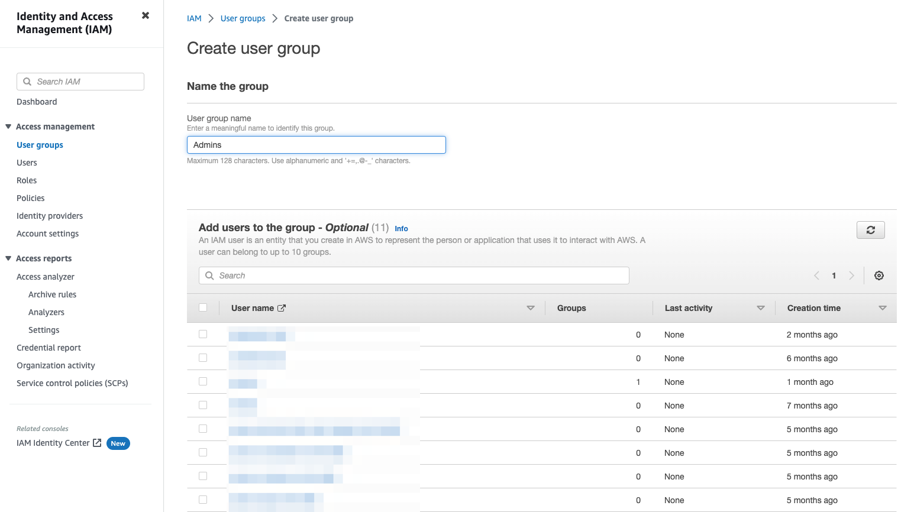

# IAM EKS user mapper
This tool aims to automatically give selected AWS IAM users access to your Kubernetes cluster. 
It's based on this [tool](https://github.com/ygrene/iam-eks-user-mapper) which is now archived, its main features were reported and extended (role based auth, and SSO for example).

## Design overview


IAM EKS user mapper is running as a pod in the kubernetes cluster.
At a given interval (default 30s) it executes the following:

**IF Groups users sync enabled**
1. Get IAM users from IAM groups to be given access to the cluster
2. Add IAM users from IAM groups `aws-auth` configmap in the cluster giving them access to the cluster

**IF SSO enabled**
- Add SSO role arn to `aws-auth` configmap in the cluster allowing users allowed to use this SSO role to connect to the cluster via SSO.

## Usage
```shell
./iam-eks-user-mapper \
    --service-account-name <SERVICE_ACCOUNT_NAME> \
    --aws-role-arn <AWS_ROLE_ARN> \
    --aws-default-region <AWS_DEFAULT_REGION> \
    --enable-group-user-sync <ENABLE_GROUP_USER_SYNC> \
    --iam-k8s-groups <IAM_K8S_GROUPS> \
    --enable-sso <ENABLE_SSO> \
    --iam-sso-role-arn <IAM_SSO_ROLE_ARN> \
    --refresh-interval-seconds <REFRESH_INTERVAL_SECONDS> \
    --verbose <VERBOSE>
```

| Parameter                  | Type      | Default | Required                                               | Description                                                                                                              | Example                                                                                                                                |
|----------------------------|-----------|---------|--------------------------------------------------------|--------------------------------------------------------------------------------------------------------------------------|----------------------------------------------------------------------------------------------------------------------------------------|
| `service-account-name`     | `String`  |         | `true`                                                 | Service account name to be used                                                                                          | `my-service-account`                                                                                                                   |
| `aws-role-arn`             | `String`  |         | `true`                                                 | AWS role ARN to be used                                                                                                  | `arn:aws:iam::12345678910:role/my-role`                                                                                                |
| `aws_default_region`       | `String`  |         | `true`                                                 | AWS default region to be used                                                                                            | `eu-west-3`                                                                                                                            |
| `refresh_interval_seconds` | `Integer` | `30`    | `false`                                                | Refresh interval in seconds between two user synchronization                                                             | `120`                                                                                                                                  |
| `enable_group_user_sync`   | `Boolean` | `false` | `false`                                                | Activate User Groups sync                                                                                                | `true`                                                                                                                                 |
| `iam_k8s_groups`           | `String`  | `""`    | `false` (`true` if `enable_group_user_sync` == `true`) | IAM groups to be mapped into Kubernetes, syntax is `<IAM_GROUP>-><KUBERNETES_GROUP>,<IAM_GROUP_2>-><KUBERNETES_GROUP_2>` | `Admins->system:masters`, `Admins->system:masters,Devops->system:devops`                                                               |
| `enable_sso`               | `Boolean` | `false` | `false`                                                | Activate SSO support to connect to the cluster                                                                           | `true`                                                                                                                                 |
| `iam_sso_role_arn`         | `String`  | `""`    | `false` (`true` if `enable_sso` == `true`)             | IAM SSO role ARN to be used to connect to the cluster                                                                    | `"arn:aws:iam::[AWS_ACCOUNT_ID]:role/aws-reserved/sso.amazonaws.com/[AWS_REGION]/AWSReservedSSO_AdministratorAccess_53b82e109c5e2cac"` |
| `verbose`                  | `Boolean` | `false` | `false`                                                | Activate verbose mode                                                                                                    | `Admins->system:masters`, `Admins->system:masters,Devops->system:devops`                                                               |

All parameters can be set as environment variables as well:

```shell
SERVICE_ACCOUNT_NAME=<SERVICE_ACCOUNT_NAME> \
AWS_ROLE_ARN=<AWS_ROLE_ARN> \
AWS_DEFAULT_REGION=<AWS_DEFAULT_REGION> \
ENABLE_GROUP_USER_SYNC=<ENABLE_GROUP_USER_SYNC> \
IAM_K8S_GROUPS=<IAM_K8S_GROUPS> \
ENABLE_SSO=<ENABLE_SSO> \
IAM_SSO_ROLE_ARN=<IAM_SSO_ROLE_ARN> \
REFRESH_INTERVAL_SECONDS=<REFRESH_INTERVAL_SECONDS> \
VERBOSE=<VERBOSE> \
./iam-eks-user-mapper
```

### Helm
Giving a `iam-eks-user-mapper.yaml` file with the following content:
```yaml
groupUsersSync:
  enabled: <ENABLE_GROUP_USER_SYNC>
  iamK8sGroups: <IAM_K8S_GROUPS> # "group1,group2"

sso:
  enabled: <ENABLE_SSO>
  iamSSORoleArn: <IAM_SSO_ROLE_ARN> # "arn:aws:iam::[AWS_ACCOUNT_ID]:role/aws-reserved/sso.amazonaws.com/[AWS_REGION]/AWSReservedSSO_AdministratorAccess_53b82e109c5e2cac"

refreshIntervalSeconds: <REFRESH_INTERVAL_SECONDS>

aws:
  defaultRegion: <AWS_DEFAULT_REGION>
  roleArn: <AWS_ROLE_ARN>

# Repository for the image is there
# https://github.com/Qovery/iam-eks-user-mapper
image:
  repository: docker pull ghcr.io/qovery/iam-eks-user-mapper
  pullPolicy: IfNotPresent
  tag: main

serviceAccount:
  name: <AWS_ROLE_ARN>
  annotations:
    - eks\\.amazonaws\\.com/role-arn=<SERVICE_ACCOUNT_NAME>

resources:
  limits:
    cpu: <RESOURCES_LIMITS_CPU>
    memory: <RESOURCES_LIMITS_MEMORY>
  requests:
    cpu: <RESOURCES_REQUESTS_CPU>
    memory: <RESOURCES_REQUESTS_MEMORY>
```

```shell
helm upgrade \
    --kubeconfig <YOUR_KUBECONFIG_FILE_PATH> \
    --install --namespace "kube-system" \
    -f "iam-eks-user-mapper.yaml" \
    iam-eks-user-mapper ./charts/iam-eks-user-mapper"
```


### Cargo
``` shell
git clone https://github.com/Qovery/iam-eks-user-mapper.git && cd $_

cargo run -- \
    --service-account-name <SERVICE_ACCOUNT_NAME> \
    --aws-role-arn <AWS_ROLE_ARN> \
    --aws-default-region <AWS_DEFAULT_REGION> \
    --enable-group-user-sync <ENABLE_GROUP_USER_SYNC> \
    --iam-k8s-groups <IAM_K8S_GROUPS> \
    --enable-sso <ENABLE_SSO> \
    --iam-sso-role-arn <IAM_SSO_ROLE_ARN> \
    --refresh-interval-seconds <REFRESH_INTERVAL_SECONDS> \
    --verbose <VERBOSE>
```

### Docker
```shell
docker run ghcr.io/qovery/iam-eks-user-mapper:main \
    -e IAM_K8S_GROUPS="<IAM_K8S_GROUPS>" \
    -e REFRESH_INTERVAL_SECONDS="<REFRESH_INTERVAL_SECONDS>" \
    -e ENABLE_GROUP_USER_SYNC="<ENABLE_GROUP_USER_SYNC>" \
    -e IAM_K8S_GROUPS="<IAM_K8S_GROUPS>" \
    -e ENABLE_SSO="<ENABLE_SSO>" \
    -e IAM_SSO_ROLE_ARN="<IAM_SSO_ROLE_ARN>" \
    -e AWS_DEFAULT_REGION="<AWS_DEFAULT_REGION>" \
    -e AWS_ROLE_ARN="<AWS_ROLE_ARN>" \
    -e SERVICE_ACCOUNT_NAME="<SERVICE_ACCOUNT_NAME>"
```

## AWS setup
### Setup a group to allow group sync
Allowing to sync IAM users from an IAM group giving IAM users access to the cluster.

First step to allow IAM user groups sync is to create a group to sync IAM side.
(Steps below are taken from [Qovery's official doc to setup an AWS cluster](https://hub.qovery.com/docs/using-qovery/configuration/cloud-service-provider/amazon-web-services/), it requires a dedicated group to run.)

1. Go to IAM AWS console


2. Create a new group **without permissions** (`Admins` in our example)




3. Add / create users within this `Admins` group


4. Pass group info `Admins` to be mapped to `system:masters` K8s role to `iam-eks-user-mapper`.
```shell
./iam-eks-user-mapper \
    --service-account-name <SERVICE_ACCOUNT_NAME> \
    --aws-role-arn <AWS_ROLE_ARN> \
    --aws-default-region <AWS_DEFAULT_REGION> \
    --enable-group-user-sync true \
    --iam-k8s-groups "Admins->system:masters"
```

### Setup SSO to allow SSO connection to the cluster
Allowing SSO connection to your k8s cluster.

You can use [this documentation](https://aws.amazon.com/fr/blogs/containers/a-quick-path-to-amazon-eks-single-sign-on-using-aws-sso/) to setup SSO to your AWS organization.

Once you've got your CLI configured and an `AWSReservedSSO_` role in IAM:

1. you can copy this role ARN


2. and pass it to `iam-eks-user-mapper`.
```shell
./iam-eks-user-mapper \
    --service-account-name <SERVICE_ACCOUNT_NAME> \
    --aws-role-arn <AWS_ROLE_ARN> \
    --aws-default-region <AWS_DEFAULT_REGION> \
    --enable-sso true \
    --iam-sso-role-arn "arn:aws:iam::84[..]37:role/aws-reserved/sso.amazonaws.com/us-east-2/AWSReservedSSO_AdministratorAccess_53b82e109c5e2cac"
```

## Good to know
The tool flags automatically synced entries via a custom field `syncedBy` set to `iam-eks-user-mapper`. This way, if you delete users from synced group and / or deactivate SSO sync or group sync, users / roles will be removed automatically.
```
│ - userarn: arn:aws:iam::843237546537:user/pleco
│   username: pleco
│   syncedBy: iam-eks-user-mapper
│   groups:
│   - system:masters
```

## Want to contribute?
This tool is far from perfect and we will be happy to have people helping making it better.
You can either:
- open an issue for bugs / enhancements
- open a PR linked to an issue
- pick an issue and submit a PR
